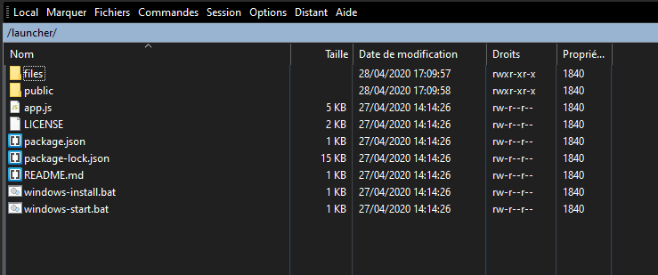
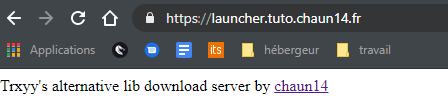

# cPanel

Connectez vous sur votre panel cPanel et allez sur la page principale

## Préparation


NodeJS monopolise le domaine qu'on lui donne, on ne peux pas mettre un site à coté,  donc je conseil de le placer dans un sous domaine comme je le fais dans ce tuto


Nous allons commencer par créer un sous domaine qui sera dédié au launcher   

## Installation

Connectez vous en ftp à votre hébergement avec WinSCP ou FileZilla par exemple

Faites en sorte d'être à la racine de vote hébergement 

Créez un dossier nommé par exemple launcher. Cliquez dessus et diminuez la fenêtre de votre client ftp.

Nous allons maintenant télécharger le serveur NodeJS depuis github [ici](https://github.com/chaun14/AlternativeApi-NodeJS-Server-lite/archive/master.zip)

Une fois l'archive téléchargée, extrayez la sur votre pc et envoyez le contenu du dossier master vers le dossier files nouvellement créé


Vous pouvez supprimer les .bat qui ne servent que sous windows


## Lancement

Retournez maintenant sur le cPanel et cherchez le bouton `Setup NodeJS App` 

Créez une nouvelle app

Et remplissez les infos demandées

`Node.js version:` Fonctionne avec la V11.X et la V12.X  
`Application mode:` Choisissez Production  
`Application root:` chemin vers le dossier qui contient le serveur web NodeJS  
`Application URL:` choisissez votre sous domaine ou votre domaine si vous n'en avez pas la possibilité   
`Application statup file:` lien vers le fichier principal du serveur, ici `app.js`   
`Passenger log file:` choisissez ou les logs seront écrits 

Une fois ces information remplies cliquez sur `create app`

Si tout se passe bien vous devez arriver sur une page comme celle là

Cliquez sur `run npm install` puis attendez quelques instants que tout s'installe.

 Une fois que l'installation est terminée, cliquez sur le bouton `restart app` 

Rendez vous sur le sous domaine que vous avez créé et si vous voyez ça

C'est que tout est installé correctement ✅  
Il ne vous reste plus qu'a coller le lien de votre sous domaine dans le launcher


En cas de problèmes, n'hésitez pas à demander de l'aide sur le serveur discord de AlternativeAPI   
Lien: [https://discord.gg/8suwuu](https://discord.gg/8suwuu)


