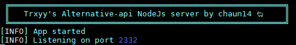

# Lancement

Nous devons maintenant installer les dépendance spécifiques au projet avec la commande:

```text
npm install
```

Une fois l'installation terminée nous pouvons désormais lancer le serveur

```text
npm start
```



