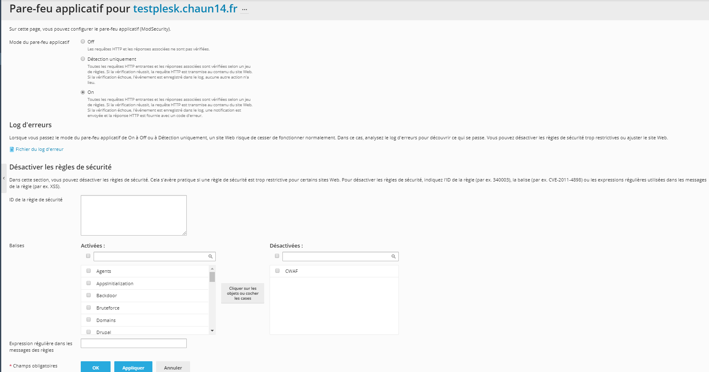
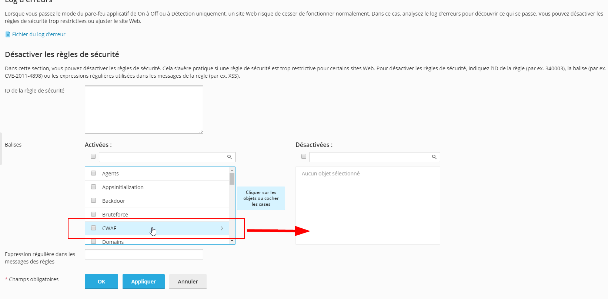

# Désactiver le pare feu

## Désactiver le pare feu sur le panel plesk

Le pare feu est souvent bien pratique mais il peut aussi poser quelques problèmes surtout avec les launcher

Vous arriverez sur un page comme ça:


Il y a plusieurs moyens de désactiver le pare feu. Préférez la première méthode à la seconde


#### Première méthode

La première méthode consiste à désactiver juste la partie du firewall \(la règle\) qui pose problème


Chez moi c'est le CWAF qui pose problème mais si ça ne résous pas le problème chez vous, procédez par élimination jusqu’à trouver la règle récalcitrante


#### Seconde méthode

La seconde méthode consiste à désactiver l'entièreté du pare-feu


Attention cela peut rendre votre site plus vulnérable à des actes malveillants



Normalement tout devrait être réparé


